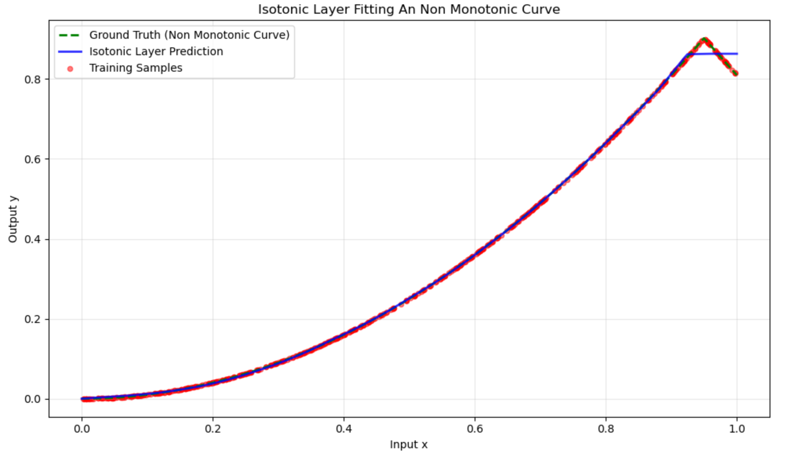

# Isotonic Layer: A Universal Framework for Generic Recommendation Debiasing

[](https://pytorch.org/)
[](https://opensource.org/licenses/MIT)

This repository contains the official PyTorch implementation of the **Isotonic Layer**, a differentiable architectural component designed to bridge the gap between flexible deep learning and rigorous monotonic constraints. It serves as a "plug-and-play" solution for model calibration and universal debiasing in recommendation systems.

## 🚀 Overview

In modern large-scale recommendation systems, predicted probabilities are often "distorted" by systemic confounding factors (e.g., position bias). The **Isotonic Layer** reformulates debiasing as a **monotonic score distortion problem**. 

By utilizing a differentiable piecewise linear formulation with non-negative weight constraints, we provide a functional bridge that maps biased observations back to their true underlying utility.

Following is a demonstration toy model to fit a non monotonic curve.
<figure>
  
  <figcaption align="center">Isotonic Layer to fit a non monotonic curve</figcaption>
</figure>


### Key Innovation: Handling Task Heterogeneity
Modern systems operate in **Multi-Task Learning (MTL)** environments (Click, Like, Purchase, etc.). These tasks exhibit heterogeneous bias profiles. Our framework allows for **task-specific isotonic embeddings**, enabling the model to adaptively "stretch" or "compress" score distributions based on the unique distortion intensity of each task.

---

## 🛠️ Quick Start

### Installation
```bash
pip install torch numpy
```

### Implementation & Source
The core implementation can be found in [Implementation in Src](src/isotonic_layer.py). You can copy the class directly into a Jupyter Lab environment or import it as a module.

### Basic Usage
```python
import torch
from src.isotonic_layer import IsotonicLayer

# Initialize Layer: Fits a range of logits [-10, 7] 
# using segments with a step size of 0.5
iso_layer = IsotonicLayer(
    units=1, 
    lower_bound=-10.0, 
    upper_bound=7.0, 
    step=0.5
)

# Example: Calibrating a raw model logit
raw_logits = torch.tensor([1.2, -0.5, 3.8])
calibrated_probs = iso_layer(raw_logits)

print(calibrated_probs)
```

## LICENCE
This project is licensed under the MIT License - see the [LICENSE](LICENSE) file for details.
