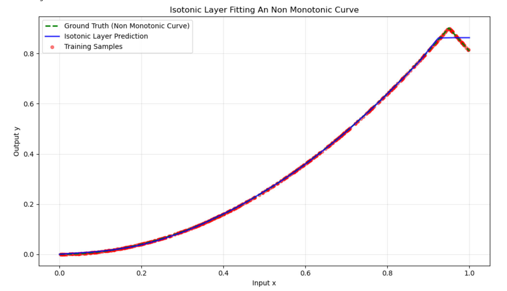

# Isotonic Layer: A Universal Framework for Generic Recommendation Debiasing

[](https://pytorch.org/)
[](https://opensource.org/licenses/MIT)

This repository contains the official PyTorch implementation of the **Isotonic Layer**, a differentiable architectural component designed to bridge the gap between flexible deep learning and rigorous monotonic constraints. It serves as a "plug-and-play" solution for model calibration and universal debiasing in recommendation systems.

## 🚀 Overview

In modern large-scale recommendation systems, predicted probabilities are often "distorted" by systemic confounding factors (e.g., position bias). The **Isotonic Layer** reformulates debiasing as a **monotonic score distortion problem**. 

By utilizing a differentiable piecewise linear formulation with non-negative weight constraints, we provide a functional bridge that maps biased observations back to their true underlying utility.




### Key Innovation: Handling Task Heterogeneity
Modern systems operate in **Multi-Task Learning (MTL)** environments (Click, Like, Purchase, etc.). These tasks exhibit heterogeneous bias profiles. Our framework allows for **task-specific isotonic embeddings**, enabling the model to adaptively "stretch" or "compress" score distributions based on the unique distortion intensity of each task.

---

## 🛠️ Quick Start

### Installation
```bash
pip install torch numpy
